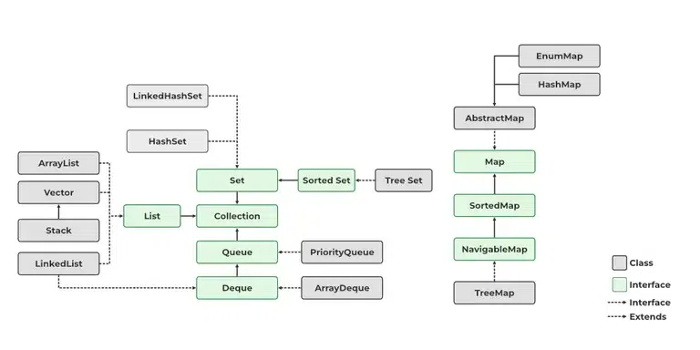
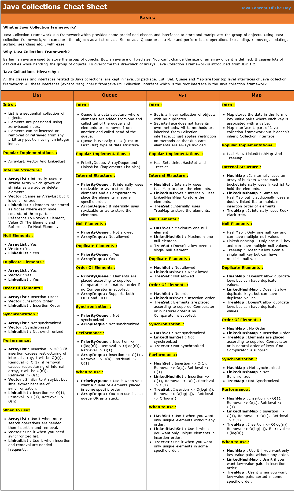

# **Java**

## Partie III - Oh que j'aime ta couleur café

### Généricité & collections

---

# Plan

1. Résumé des épisodes précédents
2. La généricité
2.1. Un problème
2.2. Une solution
3. Les collections
3.1. Aperçu
3.2. `List`
3.3. `Set`
3.4. `Map`
3.5. Résumé

---

## 1. Résumé des épisodes précédents

Dans la partie I, on a vu des généralités sur le langage. C'était touffu !

Dans la partie II, on s'est un peu détendu avec de l'outillage : création d'un projet via un IDE et outils de build.

Dans cet épisode, on va revenir vers le langage lui-même car on n'a pas tout vu !

---

## 2.1. La généricité - Un problème - 1

Un truc pénible avec Java, c'est qu'on ne peut retourner qu'un objet en retour d'une fonction. On ne peut pas faire :

```java
// Ne compile pas
(Integer, String) myFunction() {
    return (42, "Forty-two");
}
```

Imaginons que dans ton programme il y ait pleins de fonction où tu aies envie de retourner 2 valeurs. Comment faire ? 🤔

---

## 2.1. La généricité - Un problème - 2

Tu pourrais créer des objets avec deux champs, pour chaque retour de fonction :

```java
record MyFirstReturnType(String first, Integer second) {}
record MySecondReturnType(Double first, String second) {}
// etc.
MyFirstReturnType myFirstFunction() { return new MyFirstReturnType("A string", 42); }
MySecondReturnType mySecondFunction() { return new MySecondReturnType(36.7, "Another string"); }
// etc.
```

> Tiens, `record` c'est nouveau ! C'est comme une `class` mais :
> - C'est immuable (on ne peut pas modifier les champs)
> - Tous les champs sont exposés via une méthode portant le même nom que le champ

---

## 2.1. La généricité - Un problème - 3

Ça marche mais c'est un peu lourd... Une autre façon de faire, ce serait d'introduire un type `Pair` :

```java
record Pair(Object first, Object second) {}
Pair myFirstFunction() { return new Pair("A string", 42); }
Pair mySecondFunction() { return new Pair(36.7, "Another string"); }
// etc.
```

C'est plus court ! Mais il y a un problème...

---

## 2.1. La généricité - Un problème - 4

... on perd les information de typage en utilisant `Object` ! On se retrouve à faire du JavaScript, avec une syntaxe plus lourde parce qu'il faut explicitement transformer (on dit "caster") `Object` vers le bon type 😕

```java
Pair myFirstPair = myFirstFunction();
String aString = (String) myFirstPair.first();
Integer fortyTwo = (Integer) myFirstPair.second();
```

Et bien sûr on perd toutes les garanties du typage fort de Java en castant !

```java
String nope = (String) myFirstPair.second();
// Erreur à l'exécution ! (ClassCastException)
```

---

## 2. La généricité - Une solution - 1

Pour pallier ce problème (et d'autres !), on peut utiliser un concept qu'on appelle pompeusement **généricité**.

Créons le type générique `Pair<T,U>` où `T` et `U` peuvent représenter n'importe quel type :

```java
record Pair<T,U>(T first, U second) {}
Pair<String, Integer> myFirstFunction() { return new Pair<>("A string", 42); }
Pair<Double, String> mySecondFunction() { return new Pair<>(36.7, "Another string"); }
```

Du côté du code appelant, on sait de quoi on parle !

```java
Pair<String, Integer> myFirstPair = myFirstFunction();
String aString = myFirstPair.first();
Integer fortyTwo = myFirstPair.second();
String nope = myFirstPair.second(); // ne compile pas, pas d'erreur possible à l'exécution !
```

---

## 2. La généricité - Une solution - 2

Voilà, c'est tout ! Transformons notre `record Pair<T,U>` en une `class` classique pour voir comment on utilise les paramètres génériques dans les méthodes :

<style scoped>
pre {
  font-size: 0.7em;
}
</style>

```java
class Pair<T,U> {
    private final T first;
    private final U second;

    Pair(T first, U second) {
        this.first = first;
        this.second = second;
    }

    T first() { return first; }
    U second() { return second; }

    // Ça marche aussi sur les méthodes statiques !
    // Par contre, il faut répéter les paramètres de type
    // (on n'est pas obligé de les nommer T et U du coup
    // mais c'est quand même plus clair !)
    static <T, U> Pair<T,U> of(T first, U second) {
        return new Pair<>(first, second);
    }
}
```

---

## 2. La généricité - Une solution - 3

Par convention, les paramètres de type sont nommés avec une seule lettre, en commençant par `T` : `T`, `U`, `V`, ... On en a rarement plus de 3 !

Certains préfèrent mettre un nom plus explicite. Par exemple on aurait pu utiliser `FirstT` ou `SecondT` :

<style scoped>
pre {
  font-size: 0.7em;
}
</style>

```java
class Pair<FirstT,SecondT> {
    private final FirstT first;
    private final SecondT second;

    Pair(FirstT first, SecondT second) {
        this.first = first;
        this.second = second;
    }

    FirstT first() { return first; }
    SecondT second() { return second; }

    static <FirstT, SecondT> Pair<FirstT,SecondT> of(FirstT first, SecondT second) {
        return new Pair<>(first, second);
    }
}
```

---

## 3.1. Les collections - Aperçu

Les collections sont les premiers bénéficiaires de la généricité. On ne va pas recoder l'implémentation d'une liste pour chaque nouvelle classe que l'on veut stocker dedans !

Il y a globalement 3 grandes familles de collections en Java : `List`, `Set` et `Map`.

> Il y a aussi `Queue` mais je n'en parlerai pas ici. C'est moins utile je trouve !



---

## 3.2. Les collections - `List<T>`

L'interface `List<T>` définit **une collection ordonnée d'éléments**. Les méthodes principales sont :

- `add(T element)` : ajoute un élément en fin de liste
- `add(int index, T element)` : ajoute un élément à la position donnée ; déplace vers la droite l'élément qui était à cette position ansi que tous les éléments suivants.
- `remove(int index)` : supprime l'élément à la position donnée ; déplace les éléments suivants vers la gauche.
- `get(int index)` : accède au n-ième élément de la liste
- `set(int index, T element)` : remplace le n-ième élément par l'élément donné

---

## 3.2.1. Les collections - `List<T>` - `ArrayList<T>`

- La plus utilisée.
- Les éléments sont contigus en mémoire. C'est juste une couche par dessus un tableau, d'où le nom.
- `get(int n)` est rapide, quelque soit la taille de la liste.

> Conseil : utilise ça quand tu ne sais pas quoi utiliser.

---

## 3.2.2. Les collections - `List<T>` - `LinkedList<T>`

- Une [liste chaînée](https://fr.wikipedia.org/wiki/Liste_cha%C3%AEn%C3%A9e) : les éléments ne sont pas contigus en mémoire.
- `get(int n)` est d'autant plus lente que n est grand.
- Plus rapide en cas de suppression ou ajout au milieu de la liste. En théorie du moins (`ArrayList` est très très optimisée).

> Conseil : à n'utiliser qu'en cas de suppression/ajout fréquents au milieu de la liste. Si ce n'est pas le cas, ou en cas de doute, utiliser `ArrayList<T>`.

---

## 3.3. Les collections - `Set<T>`

Définit une **collection d'éléments uniques**.

- `add(T element)` : ajoute un élément
- `remove(T element)` : supprime un élément
- `contains(T element)` : retourne `true` si et seulement si le `Set` contient l'élément donné

---

## 3.3.1. Les collections - `Set<T>` - `HashSet`

- La principale implémentation
- Nécessite que la classe des objets stockés dans le `Set` implémentent correctement les méthodes `equals()` et `hashCode()`.

> On voit ce que sont `equals()` et `hashCode()` à la slide suivante !

---

## 3.3.2. Les collections - Aparté : `equals()` et `hashCode()` - 1

`equals()` et `hashCode()` sont deux méthodes de `Object` qu'il convient de surcharger pour que les méthodes des différentes collections fonctionnent correctement.

`equals()` - plus exactement `equals(Object other)` - définit l'égalité entre l'objet courant et l'objet `other` passé en paramètre.

`hashCode()` retourne un "hash" de l'objet, c'est-à-dire une valeur numérique qui est une sorte de "signature" de l'objet. 

> OK, `equals` se justifie, mais pourquoi `hashCode()` ? Bonne question ! C'est pour des raisons de performance en fait. `HashSet.contains()` stocke et compare d'abord les hash des objets (ce qui est rapide) avant de les comparer en utilisant `equals()` !

---

## 3.3.2. Les collections - Aparté : `equals()` et `hashCode()` - 2

En pratique, on laisse l'IDE les implémenter pour nous car c'est 99.9% du temps la même chose !

Les 0.1% restant, c'est si on veut faire une égalité un peu plus fine, en ignorant un champ par exemple. Ou un hash custom pour des questions de perfs j'imagine (je n'en ai jamais vu).

---

## 3.3.2. Les collections - Aparté : `equals()` et `hashCode()` - 3

Exemple généré par un IDE :

```java
class Pair<T,U> {
    // ...
    @Override
    public boolean equals(Object o) {
        if (this == o) return true;
        if (!(o instanceof MyPair<?, ?> myPair)) return false;
        return Objects.equals(first, myPair.first) && Objects.equals(second, myPair.second);
    }
    @Override
    public int hashCode() {
        return Objects.hash(first, second);
    }
}
```

> Note 1 : en cas de paramètres génériques comme ici, il faut que les types T et U implémentent eux aussi `equals()` et `hashCode` correctement !
> Note 2 : un `record` ré-implémente `equals()` et `hashCode()` correctement, pas besoin de les réécrire !

---

## 3.3.3. Les collections - `Set<T>` - `LinkedHashSet<T>`

- Un `HashSet<T>` qui est doublée par une liste chaînée.
- L'avantage : elle est ordonnée selon l'ordre d'insertion.

> À n'utiliser que quand on a besoin d'un ordre d'itération fixe. Autrement `HashSet<T>` est préférable car un peu moins coûteux.

---

## 3.3.4. Les collections - `Set<T>` - `TreeSet<T>`

- Un `Set` implémenté par un arbre [Rouge-Noir](https://fr.wikipedia.org/wiki/Arbre_bicolore). Oui, je me la pète !
- L'avantage : la collection est ordonnée, selon l'ordre que l'on veut ! (On peut fournir un `Comparator` en paramètre du constructeur pour ça.)

> À n'utiliser que quand on a besoin d'ordonner les éléments selon un ordre bien défini, qui n'est pas forcément l'ordre d'insertion. Autrement, utiliser `LinkedHashSet` ou `HashSet` qui sont plus performants.

---

## 3.4. Les collections - `Map<K,V>`

`Map<K,V>` est une collection de valeurs de type `V`, indexées par des clés de type `K`. C'est appelé tableau associatif dans d'autres langages.

Les méthodes les plus courantes :

- `get(K key)` : retourne la valeur indexée par la clé donnée, ou `null` si pas de valeur à cette clé
- `put(K key, V value)` : définit la valeur pour la clé donnée, écrase la valeur précédente s'il y en avait une
- `remove(K key)` : supprime l'entrée pour la clé donnée

---

## 3.4.1. Les collections - `Map<K,V>` - Implémentations

- **`HashMap<K,V>` : l'implémentation la plus utilisée.**
- `LinkedHashMap<K,V>` : à utiliser quand on veut être capable de parcourir les paires (clé, valeur) selon l'ordre d'insertion.
- `TreeMap<K,V>` : à utiliser quand on veut être capable de parcourir les paires (clé, valeur) selon un ordre défini à la construction par un `Comparator`.
- `EnumMap<K,V>` : à utiliser quand les clés sont des `enum`, c'est très performant.

---


## 3.5 Les collections - Résumé

Ci-contre un tableau récapitulatif honteusement pompé sur le net. En plus large [ici](https://i0.wp.com/javaconceptoftheday.com/wp-content/uploads/2022/12/Java_Collections_Cheat_Sheet.png?ssl=1).



---

## Exercice

Crée une classe `Pokeball` stockant des `Pokemon`. Elle doit avoir les fonctionnalités suivantes :

- Ajouter de nouveaux `Pokemon`: `void add(Pokemon pokemon)`.
- Compter le nombre de `Pokemon`: `int pokemonCount()`.
- Obtenir une collection de tous les `Pokemon` d'un `PokemonType` donné. Modifier cette collection ne doit pas modifier le contenu de la `Pokeball`: `Collection<Pokemon> pokemonsOfType(PokemonType type)`.
- Retirer le dernier `Pokemon` ajouté. `Pokemon removeLastPokemon()`.
- Retirer le dernier `Pokemon` ajouté d'un `PokemonType` donnée: `Pokemon removeLastPokemonOfType(PokemonType type)`.

---

## Fin de la troisième partie

Des questions ?

---

## Teaser

Dans les parties suivantes, je pense aborder :

- Les `Stream`s qui rajoutent aux collections la possibilité de faire des `filter()`, `map()` ou `reduce()` que tu as sans doute vu en Javascript
- Les tests avec JUnit
- Les exceptions
- Spring ?